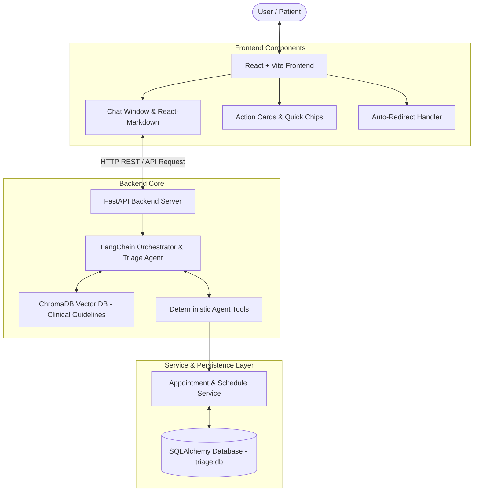

# Patient Engagement & Triage Bot (PETB) - Complete System Workflow & Architecture Document

This document presents an end-to-end overview of the **Patient Engagement & Triage Bot (PETB)** system workflow, component architecture, data flows, dynamic slot booking mechanisms, and performance optimization strategies for team leads and engineering stakeholders.

---

## Executive Summary

**PETB** is an intelligent medical triage and appointment scheduling chatbot platform. It combines:
1. **Interactive Frontend (React + Vite)**: A responsive, high-performance chat UI with structured action cards, rich Markdown formatting, and automated page navigation.
2. **AI Agent Backend (FastAPI + LangChain + ChromaDB)**: A dual-engine AI pipeline providing retrieval-augmented symptom triage and deterministic database tool execution.
3. **Dynamic Database Architecture (SQLAlchemy + SQLite/PostgreSQL)**: Decoupled schedule templates supporting real-time slot availability calculation without hardcoded dates or stale booking hallucinations.

---

## High-Level Architecture Overview



---

## Core Components & Connectivity

### 1. Frontend Layer (`frontend/src`)
- **Technology Stack**: React, Vite, React Router DOM, Tailwind/Custom CSS, Lucide React icons, `react-markdown`.
- **Primary Modules**:
  - `App.jsx` & Router: Manages page navigation across Chat, Confirmation, Doctor Directory, and Booking History.
  - `ChatWindow.jsx`: Chat stream manager supporting user input, quick suggestions (`QuickChips.jsx`), loading states, and message list rendering.
  - `ChatMessage.jsx`: Renders message bubbles cleanly using `react-markdown` with syntax highlighting and GFM support.
  - `ActionCard.jsx`: Interactive card component triggered by backend action payloads (e.g., displaying doctor slot grids, booking summaries, and action buttons).
- **Communication Protocol**: Interacts with the backend REST endpoints (`/api/chat`, `/api/doctors`, `/api/appointments`).

---

### 2. FastAPI Backend Server (`backend/app`)
- **Technology Stack**: FastAPI, Pydantic v2, Uvicorn, LangChain, Ollama / Local LLM embeddings.
- **Primary Endpoints**:
  - `POST /api/chat`: Main agent chat interface accepting conversation history and returning structured AI responses.
  - `GET /api/doctors`: Queries doctor profiles, specialties, and schedule metadata.
  - `GET /api/appointments/slots`: Generates dynamic open time slots for a given doctor and date.
  - `POST /api/appointments/book`: Executes atomic database booking transaction.

---

### 3. AI Triage Agent & Tool-Calling Pipeline (`backend/app/services/agent_service.py`)
The system employs a **LangChain Agent** configured with system prompts, clinical triage safety guardrails, and deterministic tool bindings:
- **Medical RAG Engine (`rag_service.py`)**: Uses ChromaDB vector search to query stored clinical guidelines and symptom triage protocols before formulating response logic.
- **Agent Tools**:
  1. `search_doctors`: Searches database by specialty, name, or availability.
  2. `get_available_slots`: Queries real-time open time slots for doctors without hallucinatory outputs.
  3. `book_appointment`: Validates patient input and atomically locks database slots.
  4. `triage_symptoms`: Assesses symptom severity (Emergency, Urgent, Routine) and provides clinical recommendations.
- **Action Payloads Protocol**: The backend returns structured Pydantic response payloads:
  ```json
  {
    "response": "I have found available slots for Dr. Smith.",
    "action": "DISPLAY_SLOTS",
    "data": {
      "doctor_id": 1,
      "date": "2026-09-05",
      "slots": ["09:00 AM", "10:00 AM", "02:00 PM"]
    }
  }
  ```

---

### 4. Dynamic Schedule Database Architecture (`backend/app/db` & `backend/app/models`)
To prevent hardcoded dates and stale booking errors, the database schema decouples **working hours templates** from **actual bookings**:

```
+--------------------------+          +---------------------------+
| DoctorScheduleTemplate   |          | Appointment               |
+--------------------------+          +---------------------------+
| doctor_id (FK)           |          | id (PK)                   |
| day_of_week (0-6)        |          | doctor_id (FK)            |
| start_time (e.g. 09:00)  |          | patient_name              |
| end_time (e.g. 17:00)    |  <--->   | appointment_date (DATE)   |
| slot_duration (30 mins)  |          | appointment_time (TIME)   |
| lunch_start / lunch_end  |          | status (CONFIRMED/CANCEL) |
+--------------------------+          +---------------------------+
```

#### Dynamic Slot Calculation Flow (`appointment_service.py`):
1. **Request Date**: Patient asks for slots on a specific date (e.g., Tomorrow).
2. **Template Match**: System looks up `DoctorScheduleTemplate` for that date's day-of-the-week.
3. **Time Slot Generation**: Generates 30-minute intervals between `start_time` and `end_time` (excluding lunch breaks).
4. **Conflict Filtering**: Queries existing `Appointment` records for that doctor on that exact date and filters out booked times.
5. **Real-Time Return**: Returns guaranteed free time slots.

---

## Detailed User Journey & Step-by-Step Flow

```
[Patient] -> "I have severe knee pain and want to book an appointment with an Orthopedic doctor tomorrow."
   │
   ├──> 1. FRONTEND: Sends JSON POST payload to `/api/chat` with user query + session history.
   │
   ├──> 2. BACKEND / AGENT:
   │       a. RAG Vector Search checks clinical guidelines for "knee pain".
   │       b. LLM Agent recognizes intent: Needs (1) Triage advise & (2) Doctor lookup.
   │       c. Tool Call Executed: `search_doctors(specialty="Orthopedics")`.
   │       d. DB returns Dr. Sarah Jenkins (ID: 2).
   │       e. Tool Call Executed: `get_available_slots(doctor_id=2, date="2026-09-05")`.
   │       f. Service dynamically builds slots from template & removes booked appointments.
   │
   ├──> 3. BACKEND RESPONSE:
   │       Returns formatted markdown answer + structured `DISPLAY_SLOTS` action card data payload.
   │
   ├──> 4. FRONTEND RENDERING:
   │       a. `react-markdown` presents formatted triage advice cleanly (no raw markdown markers).
   │       b. `ActionCard.jsx` renders clickable time slot chips (9:00 AM, 10:30 AM, 2:00 PM).
   │
   ├──> 5. BOOKING & AUTO-REDIRECT:
   │       a. Patient clicks "10:30 AM".
   │       b. Agent invokes `book_appointment(...)` with database lock transaction.
   │       c. Backend returns `REDIRECT_TO_CONFIRMATION` action payload.
   │       d. React Router automatically transitions UI to `/confirmation` with booking details.
```

---

## Local LLM Bottleneck Analysis & Optimization Suggestions

### Current Bottleneck: Why Local LLMs Cause Slow Chat Responses
Currently, the system utilizes local model execution (e.g., Ollama running Llama 3 / Mistral on local CPU/GPU hardware). This introduces high latency due to:
1. **High Time-to-First-Token (TTFT)**: Cold start loading of model weights and prompt processing.
2. **Low Token Generation Speed (Tokens/Sec)**: Memory bandwidth constraints on local workstation GPUs/CPUs during generation.
3. **Sequential Multi-Tool Calling**: When the agent makes multiple tool calls (e.g. RAG retrieval -> doctor search -> slot check), each reasoning step requires a separate LLM inference call.

---

### Recommended Solutions for the Team Lead

#### 1. Transition to High-Speed Cloud LLM APIs (Recommended for Production)
- **Groq API**: Offers ultra-fast inference speeds (300-500 tokens/sec) with open-source models (Llama 3.1 70B/8B). Enables sub-second response times.
- **Google Gemini Flash (3.5 / 1.5 Flash)** or **OpenAI GPT-4o-mini**: Low-cost, extremely fast latency (< 500ms TTFT) with reliable tool-calling abilities.

#### 2. Streaming Response Architecture (Server-Sent Events / WebSockets)
- Update FastAPI `/api/chat` to stream responses using **Server-Sent Events (SSE)** via `StreamingResponse`.
- Update React frontend to read streamed chunks. This provides immediate visual feedback to the user while full generation completes.

#### 3. Optimized Local Inference Engine (If Local Execution is Mandatory)
- **Switch to vLLM or TensorRT-LLM**: vLLM provides up to 10x throughput improvement over standard Ollama using PagedAttention.
- **Model Quantization**: Use GGUF `Q4_K_M` or `INT4` quantized models to minimize VRAM memory footprint and accelerate token throughput.
- **Dedicated GPU Passthrough**: Ensure Ollama/vLLM is running explicitly on NVIDIA CUDA GPU with full layer offloading (`num_gpu=99`).

#### 4. Hybrid Routing & Caching Strategy
- **Intent Classifier / Fast Router**: Use a tiny fast model (e.g. 1B parameter model or regex classifier) for simple queries and greetings, routing only complex symptom triage and scheduling to the main agent.
- **Redis Semantic Caching**: Cache common triage answers and embedding queries so recurring questions resolve in < 10ms without hitting the LLM.

---

## Summary Checklist for Team Presentation

| Feature / Aspect | Status / Implementation |
| :--- | :--- |
| **Markdown Formatting** | Clean `react-markdown` rendering (lists, tables, bold text). |
| **Interactive UI** | Custom Action Cards for doctor slot selection & quick chips. |
| **Booking Reliability** | Deterministic tool execution with dynamic schedule templates & atomic DB locks. |
| **Navigation** | Auto-redirect system on confirmation payload receipt. |
| **Performance Strategy** | Transition plan from local slow LLMs to Groq/vLLM & SSE Streaming. |
